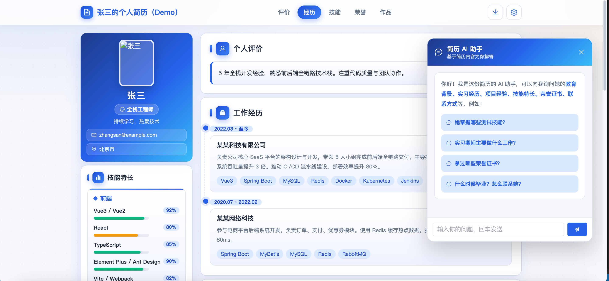
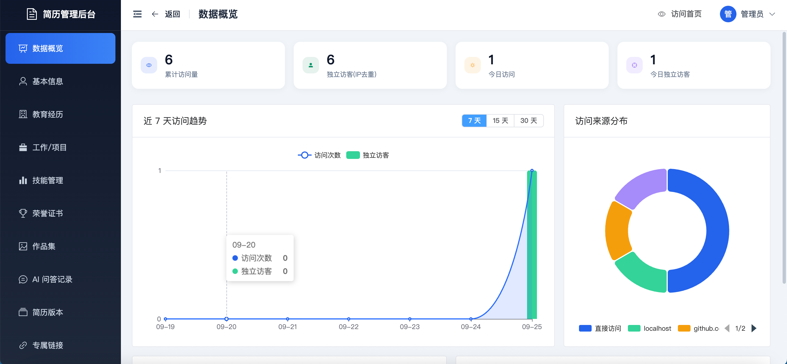
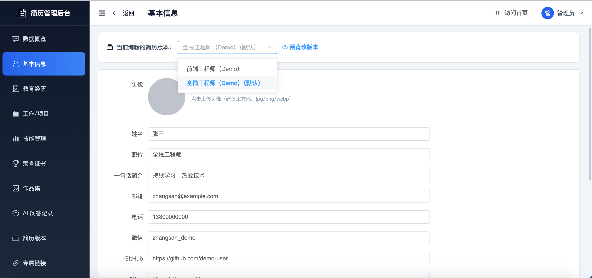
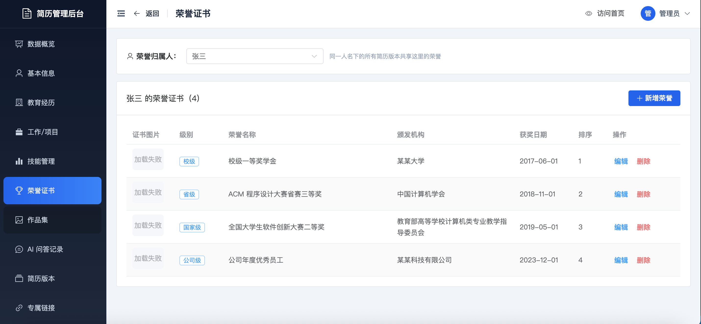

# 个人简历网站 Personal Resume Website

基于 **Vue 3 + Spring Boot 3 + H2** 的全栈个人简历网站，包含可动态维护的简历展示前台、JWT 鉴权管理后台，以及多主题切换、访客统计、AI 智能问答、简历多版本四大扩展功能。

## 效果预览

### 前台首页



### 后台管理







## 一、功能总览

### 基础功能
- 前台单页简历：首页（头像/姓名/职位/slogan/社交链接）、个人评价、教育经历、工作/项目经历（时间线）、技能熟练度进度条、荣誉证书、作品集卡片、联系方式与 AI 问答
- 简历 PDF 导出（html2canvas-pro + jsPDF，A4 自动分页）
- 后台 JWT 登录鉴权，基本信息、教育、经历、技能、作品集的增删改查
- 图片上传（头像、作品封面），本地存储并按日期分目录
- 留言查看与删除

### 扩展功能
| 功能 | 说明 |
|------|------|
| 多主题切换 | 内置 **商务蓝 / 暗夜科技 / 清新绿** 3 套主题，CSS 变量一键换肤；访客选择持久化在 localStorage；后台可配置默认主题 |
| 访客访问统计 | 记录每次访问的真实 IP、UA、来源 Referer、路径、时间；**独立 IP 去重**统计；后台仪表盘提供总览卡片、近 7/15/30 天趋势图（ECharts）、来源分布饼图、活跃 IP Top 10 |
| AI 智能问答 | 以数据库中指定版本简历的全部内容作为知识库，对接 OpenAI 兼容大模型接口，支持同会话多轮上下文；未配置 API Key 时自动降级为本地关键词问答；问答历史后台可查可删 |
| 简历版本管理 | 可创建多套独立简历（内容互不影响），支持从已有版本一键克隆、重命名、删除、设置默认版本，前台通过 `?versionId=x` 预览任意版本 |

## 二、技术栈

- 前端：Vue 3 + Vite 5 + Element Plus + Pinia + Vue Router 4 + Axios + ECharts + html2canvas-pro + jsPDF
- 后端：Spring Boot 3.2 + Spring Security + JJWT 0.12 + MyBatis-Plus 3.5 + H2 Database + Lombok
- 数据库：H2 2.2（文件模式，MySQL 兼容语法，数据持久化在磁盘）
- 部署：Docker Compose（后端 JRE 镜像 + 前端 Nginx 镜像，零外部数据库依赖）

## 三、目录结构

```
Resume
├── backend/                     # Spring Boot 后端
│   ├── src/main/java/com/example/resume
│   │   ├── common/              # 统一响应 Result、全局异常
│   │   ├── config/              # Security、CORS、MyBatis-Plus、静态资源
│   │   ├── controller/          # REST 控制器
│   │   ├── dto/ vo/             # 请求/响应模型
│   │   ├── entity/ mapper/      # 实体与 Mapper
│   │   ├── init/                # 启动数据兜底初始化
│   │   ├── security/            # JWT 工具与认证过滤器
│   │   ├── service/             # 业务层（含 AI、统计、版本等）
│   │   └── util/                # IP 工具
│   ├── src/main/resources/
│   │   ├── schema.sql           # H2 建表脚本（INIT 每次连接执行，语句全部幂等）
│   │   ├── application.yml      # 公共配置
│   │   └── application-prod.yml  # 生产覆盖配置
│   │   （示例简历脚本 data.sql 不在仓库里，见「四、快速开始」和「九、数据库说明」）
│   └── Dockerfile
├── frontend/                    # Vue 3 前端
│   ├── src/
│   │   ├── api/                 # 接口封装
│   │   ├── components/home/     # 前台区块组件
│   │   ├── components/admin/    # 后台复用组件
│   │   ├── composables/         # 版本作用域等组合式函数
│   │   ├── layouts/             # 后台布局
│   │   ├── router/ store/       # 路由与 Pinia
│   │   ├── styles/theme.css     # 三套主题 CSS 变量
│   │   └── views/ home|admin/   # 页面
│   ├── nginx.conf
│   └── Dockerfile
├── docker-compose.yml
└── README.md
```

## 四、快速开始

### 方式 A：Docker Compose 一键启动（推荐）

```bash
# 在项目根目录
docker compose up -d --build
```

- **H2 内嵌数据库自动建表 + 空库灌初始数据**（零外部依赖，无需手动准备数据库）；建表脚本幂等，重启不覆盖运行期数据，见「九、数据库说明」
- 前端地址：http://localhost （WEB_PORT 可改）
- 后端地址：http://localhost:8081
- 初始管理员：账号口令由 `ADMIN_USERNAME`/`ADMIN_PASSWORD` 指定，未设置时取 `application.yml` 里的本地默认值；首次登录后请立即改密

可用环境变量覆盖默认配置（见 `docker-compose.yml`）：
`H2_USER`、`H2_PASSWORD`、`WEB_PORT`、`BACKEND_PORT`、`ADMIN_USERNAME`、`ADMIN_PASSWORD`、
`JWT_SECRET`、`AI_API_URL`、`AI_API_KEY`、`AI_MODEL`。

### 方式 B：本地开发运行

**1. 启动后端**

直接跑，**H2 数据库自动就绪**：

```bash
cd backend
mvn spring-boot:run
```

后端运行在 http://localhost:8081。首次启动自动：
- H2 以文件模式在 `./data/resume.mv.db` 落盘；JDBC URL 的 `INIT=RUNSCRIPT` 每次连接都执行 `schema.sql`，脚本内 12 条建表、11 条索引全部 `IF NOT EXISTS` 且不含 `DROP TABLE`，因此重复执行不会改动已有数据
- `resume_version` 为空时才导入示例简历数据；已有数据则跳过。这份脚本不入版本库、也不放 `src/main/resources`（放在那里会被打进 jar），所以首次启动得到的是空白库，只建表和一条默认版本；需要灌示例内容时，把根目录的 `resume_seed.sql` 复制成 `src/main/resources/data.sql` 再启动
- 创建管理员账号（`ADMIN_USERNAME`/`ADMIN_PASSWORD`，未设置时取本地默认值），`user` 表非空则跳过
- 兜底创建默认简历版本与站点配置，两张表各自判空

> 需要清空数据重来？停掉后端 → 删除 `backend/data/` 目录 → 再启动。

**2. 启动前端**

```bash
cd frontend
npm install
npm run dev
```

访问 http://localhost:5173 （Vite 已配置 `/api`、`/uploads` 代理到 8081 端口）。

## 五、功能使用说明

1. 打开前台首页，右下角依次为 **AI 问答入口**与**主题切换按钮**，右上角可导出 PDF、进入后台。
2. 用初始管理员账号登录后台（见「方式 A」的说明）：
   - **数据概览**：查看访问量、独立 IP、趋势图、来源分布。
   - **基本信息 / 教育 / 工作项目 / 技能 / 作品集**：各页面顶部先选择要编辑的**简历版本**，再进行增删改；头像与封面通过上传接口保存到后端。
   - **简历版本**：创建新版本时可选择从现有版本克隆全部内容；「设为默认」即一键切换前台展示版本；「预览」打开 `/?versionId=ID` 查看该版本。
   - **主题与站点**：配置站点标题、**默认主题**、AI 问答开关。
   - **AI 问答记录**：按会话筛选、单条删除或清空。

### 启用大模型问答

在 `application.yml` 或环境变量中配置 OpenAI 兼容接口（支持任意兼容 Chat Completions 协议的服务）：

```yaml
app:
  ai:
    api-url: https://api.openai.com/v1/chat/completions
    api-key: sk-xxxxxx
    model: gpt-4o-mini
```

不配置 `api-key` 时系统自动使用内置本地关键词问答，功能依然可用（回答来源会标记为「本地问答」）。

## 六、接口文档（Knife4j + springdoc-openapi）

项目已集成 **Knife4j 4.5.0**（底层 springdoc-openapi 3，适配 Spring Boot 3 / Jakarta），全部接口均带中文 `@Tag/@Operation/@Parameter/@Schema` 注解，并按职责分为 **「01-前台公开接口」「02-后台管理接口(JWT)」** 两个分组。

**访问地址**（后端启动后）。jar 零参数启动即 `prod` profile，`knife4j.production` 默认为 `true`，文档资源是关闭的；本地想看文档，设 `KNIFE4J_PRODUCTION=false` 或 `SPRING_PROFILES_ACTIVE=default`：

| 入口 | 地址 |
|------|------|
| Knife4j 文档 UI（推荐） | http://localhost:8081/doc.html |
| 原生 Swagger UI | http://localhost:8081/swagger-ui.html |
| OpenAPI JSON | http://localhost:8081/v3/api-docs |
| Docker/Nginx 部署后 | http://localhost/doc.html （Nginx 已代理文档路径） |

**调试需要 JWT 的后台接口**：

1. 在「01-前台公开接口」分组调用 `POST /api/auth/login`（用初始管理员账号），从响应复制 `data.token`；
2. 点击文档页右上角 **Authorize** 按钮，在 `Bearer-JWT` 输入框中粘贴 token（直接粘贴 token 即可，系统自动拼接 `Bearer ` 前缀）；
3. 之后所有 `/api/admin/**` 接口都会自动携带 `Authorization` 头，可直接在线调试。

**生产环境关闭文档**：设置环境变量 `KNIFE4J_PRODUCTION=true`（或改 `application.yml` 中 `knife4j.production`）即可屏蔽文档资源；`/doc.html`、`/swagger-ui.html`、`/webjars/**`、`/v3/api-docs/**` 等路径已在 Spring Security 中白名单放行，不影响业务接口鉴权。

## 七、RESTful 接口一览

统一响应格式：`{ "code": 200, "msg": "success", "data": ... }`

**公开接口（无需凭证）**

| 方法 | 路径 | 说明 |
|------|------|------|
| POST | /api/auth/login | 登录获取 JWT |
| POST | /api/auth/logout | 退出 |
| GET | /api/share/access?token= | 凭专属链接换取访客令牌（IP 限流） |
| GET | /uploads/** | 上传的图片（文件名是随机串） |

**简历内容接口（需 `Authorization: Bearer <token>`，管理员令牌或专属链接换得的访客令牌均可）**

| 方法 | 路径 | 说明 |
|------|------|------|
| GET | /api/profile?versionId= | 个人信息 |
| GET | /api/educations?versionId= | 教育经历 |
| GET | /api/experiences?versionId=&type= | 工作(1)/项目(2)经历 |
| GET | /api/skills?versionId= | 技能 |
| GET | /api/portfolios?versionId= | 作品集 |
| GET | /api/honors | 荣誉证书（按归属人） |
| GET | /api/config | 站点配置（默认主题、开关） |
| POST | /api/visit | 访问上报 |
| POST | /api/ai/chat | AI 提问 |

其余未列出的路径一律 `denyAll`，简历版本列表在管理接口分组（`/api/admin/versions`）。

**管理接口（/api/admin/**，均需 `Authorization: Bearer <token>`）**

- `PUT /api/admin/profile`
- `PUT /api/admin/account/password`（修改登录密码：校验原密码，新密码 8~64 位；改完已签发 JWT 仍有效）
- `POST|PUT /api/admin/educations`、`DELETE /api/admin/educations/{id}`（经历/技能/作品同理）
- `GET|POST /api/admin/share-links`、`PUT /api/admin/share-links/{id}/disable`（吊销）、`PUT /api/admin/share-links/{id}/token`（修复/更换 Token，用于误删后沿用旧地址）
- `GET /api/admin/owners`（荣誉/作品集归属人候选）
- `GET|POST|PUT|DELETE /api/admin/versions[/{id}]`、`PUT /api/admin/versions/{id}/default`
- `PUT /api/admin/config`
- `GET /api/admin/stats/overview|trend|sources|top-ips`
- `GET|DELETE /api/admin/ai/history[/{id}]`
- `POST /api/admin/upload`（multipart/form-data，字段名 file）

## 八、生产部署注意事项

1. 务必通过环境变量覆盖 `JWT_SECRET` 与 `ADMIN_PASSWORD`，或首次登录后用后台右上角头像下拉里的「修改密码」改掉默认口令（`ADMIN_PASSWORD` 只在 `user` 表为空时写入一次，改过之后重启不会刷回默认值）。
2. Nginx 配置见 `frontend/nginx.conf`，已包含 SPA 回退、`/api`、`/uploads`、Knife4j 文档路径代理、gzip 与静态缓存。
3. 生产环境设置 `KNIFE4J_PRODUCTION=true` 关闭 `/doc.html` 接口文档，避免接口结构外泄。
4. 上传文件默认存于后端 `./uploads`（容器内 `/app/uploads`，已用 volume 持久化）。
5. H2 数据库文件存于后端 `./data/resume.mv.db`（容器内 `/app/data`，已用 volume 持久化），备份直接复制该文件即可。

## 九、数据库说明（H2）

本项目使用 **H2 内嵌数据库**，MySQL 兼容语法模式，具备以下特性：

| 特性 | 说明 |
|------|------|
| 运行模式 | 文件模式（`jdbc:h2:file:...`），数据持久化在磁盘，重启不丢失 |
| 兼容模式 | `MODE=MySQL`，保留反引号、AUTO_INCREMENT、LIMIT/OFFSET 等 MySQL 语法 |
| 自动初始化 | JDBC URL 带 `INIT=RUNSCRIPT FROM 'classpath:schema.sql'`，每次连接执行建表脚本；语句全部幂等，表已存在时无操作。示例数据不在这里导入，由 `DataInitializer` 在 `resume_version` 为空时执行一次 `data.sql`（该脚本不入版本库、也不在 resources 里，缺少该文件时跳过导入） |
| 关键字规避 | `NON_KEYWORDS=USER` 让 `user` 表名不触发 H2 关键字冲突 |
| 重置方式 | 停后端 → 删除 `data/` 目录 → 重启，H2 自动重建库；得到一个空库（建表 + 一条默认版本）；要灌示例内容，先把根目录 `resume_seed.sql` 复制成 `src/main/resources/data.sql` |
| 备份方式 | 停后端 → 复制 `data/resume.mv.db` 即可，单文件完整快照 |

### 迁移自 MySQL

如果之前使用 MySQL，迁移步骤为：
1. 在本地执行 `mvn clean package -DskipTests` 重新打包（`pom.xml` 已替换为 H2 依赖）
2. 上传新 jar 到服务器，替换旧 jar
3. 删除服务器上的 MySQL 服务（H2 零外部依赖）
4. `schema.sql` 每次连接都会重跑，但语句全部幂等，已建好的表和数据不受影响；示例数据迁移靠根目录的 `resume_dump.sql` / `resume_seed.sql`，两者都不入版本库
5. 注意：旧 MySQL 中运行时产生的访问日志、AI 对话记录等数据**不会自动迁移**，需要按表导出 INSERT 再导入；仓库里没有示例脚本，空库首次启动只会建表和一条默认版本